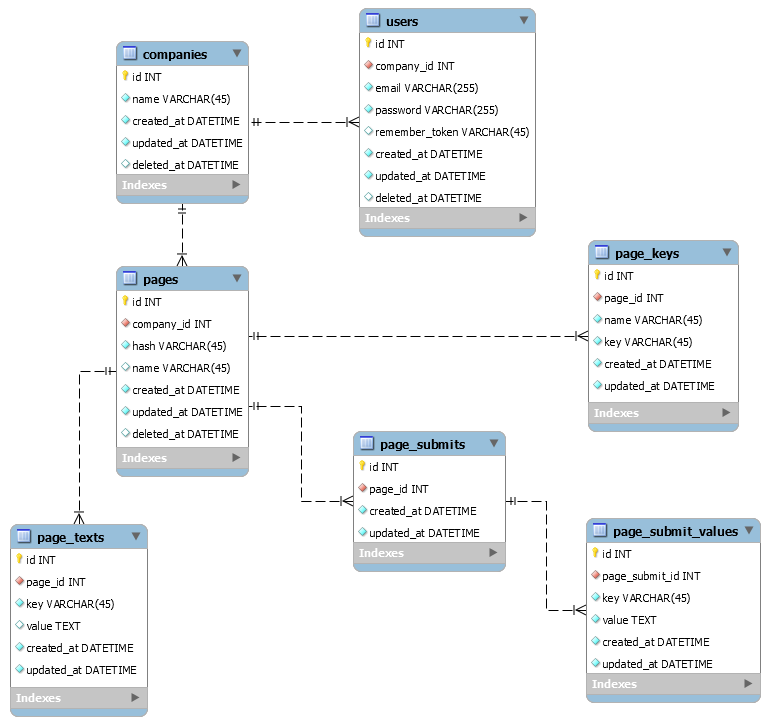

# CP9 invite competition module

## Getting Started

These instructions will get you a copy of the project up and running on your local machine for development and testing purposes.

### Prerequisites

* PHP >= 7.1
* MySQL / MariaDB >= 5.5

### Installing

* Clone this repository
* Install [composer](https://getcomposer.org/Composer-Setup.exe) or run `composer self-update`
* Run `composer install`
* Create a new database, preferably with name `cp9_invite_comp` and `utf8_general_ci` collation
* Create your own `.env` file: Copy and modify file `.env.example`
* Run `php artisan migrate:refresh --seed` to migrate and seed your database
* Run `npm i` to install node dependencies
* Run `npm run dev` to process scss and vue files, etc.
* Run `php artisan serve` or set up vhost, add to hostfile, etc.

## Where to start
The login url is `/admin/login`  
Pick any user from the database, every seeded user's password is "secret".
Pages are available at `/{page's hash}` url  

## Updating your working version
* `git pull`
* `composer install`
* `php artisan migrate` or `php artisan migrate:fresh`  

## Contributing

* ALWAYS create a new branch for a new feature, and merge it to test and/or master ONLY when you are done!
* PSR-2 is required. Read about it [here](https://github.com/php-fig/fig-standards/blob/master/accepted/PSR-2-coding-style-guide.md)

## Database scheme

## Testing
* WARNING! Currently the dusk tests are using the very same database connection as the app. Your data will be overwritten by running the tests.
* Overwrite the APP_URL in your .env file if necessary
* Run `php artisan serve` if you did not set up vhost, etc.
* Run `php artisan dusk` to run browser tests

## Dependencies
* [Laravel 5.5](https://laravel.com/docs/5.5)
* [Laravel Excel](https://github.com/Maatwebsite/Laravel-Excel)
* [Laravel Tinker](https://github.com/laravel/tinker)
* [Vee validate](https://github.com/baianat/vee-validate)

## Dev dependencies
* [Laravel IDE Helper](https://github.com/barryvdh/laravel-ide-helper)
* [Laravel Dusk](https://github.com/laravel/dusk)
* [Faker](https://github.com/fzaninotto/faker)

## Known problems and their solutions

* If you run into any errors migrating the database, you can try and drop all tables, or run `composer dump-autoload` before migrating
* You cannot generate docblock for models with the IDE helper: set the timezone to UTC in config/app.php
